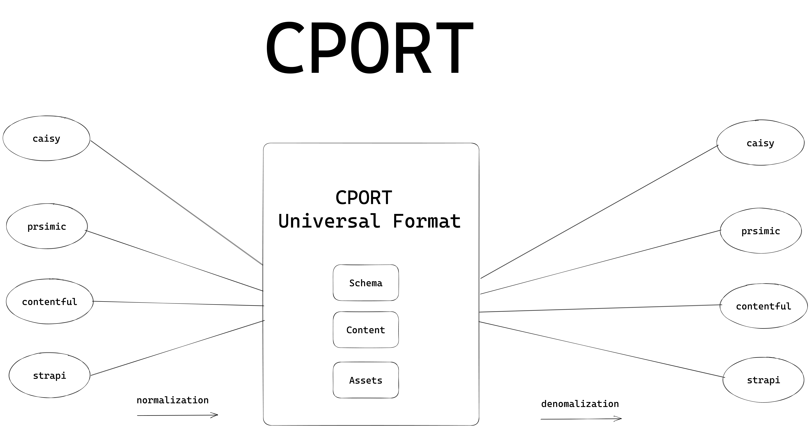
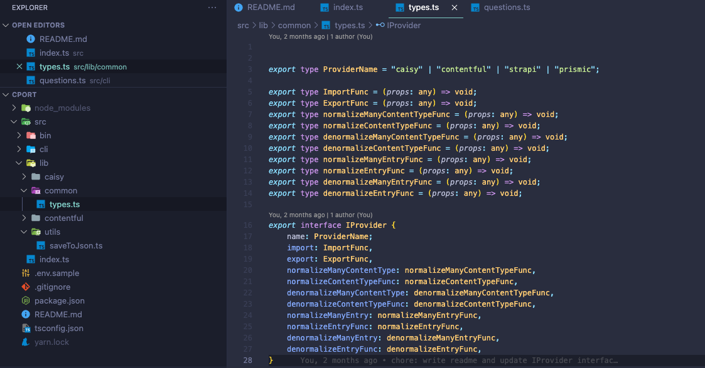

# Cport Project

If you encounter any issues or have suggestions for improvements, please open an issue or submit a pull request. Contributions are welcome!

The cport project aims to provide an import/export tool for multiple headless CMS platforms. The project roadmap outlines the main areas of development and progress status.

Here is a explainationen video of CPORT:
https://www.loom.com/share/Cport-Making-Data-Import-and-Export-Easy-fc94726ced0442aaafe474c11edd95c9?sid=b58fb118-122b-4178-93da-56896c27e09c



Very importat is this provider interface that every provider needs to implement: https://github.com/caisy-io/cport/blob/0dc3929afa285f80eef059366b0cfc7d20c44836/src/lib/common/types.ts


## ⚠️ **DISCLAIMER** ⚠️

This project is currently in a very early stage of development and is considered a work in progress. Breaking changes are expected to occur frequently as the codebase evolves. **This project is not yet ready for production use.**

The code is provided as-is, without any guarantees or warranties. Use at your own risk. We do not recommend using this project in production environments until it reaches a more stable state.

## Topics:

1. **Find a Good Normalization Format:** Find a compatible format for normalization that can handle all CMS data structures. This involves:
   - Blueprints
   - Entries
2. **Write Exporter:** Develop modules that fetch data from each CMS API.
3. **Write Importer:** Develop modules that write data to each CMS API.
4. **Write Normalization Functions:** Develop normalization functions for each headless CMS, which involves:
   - Blueprints
   - Entries
5. **Write Denormalization Functions:** Develop denormalization functions for each headless CMS, which involves:
   - Blueprints
   - Entries

## Progress Status:

Below is a matrix-based table showing the progress for each headless CMS.

| Headless CMS | Normalization function | Denormalization function | Export | Import |
| ------------ | ---------------------- | ------------------------ | ------ | ------ |
| Caisy        | 🚧                     | 🚧                       | 🚧     | 🚧     |
| Contentful   | 🚧                     | 🚧                       | 🚧     | 🚧     |
| Strapi       | ❌                     | ❌                       | ❌     | ❌     |
| Prismic      | 📅                     | 📅                       | 📅     | 📅     |

## Key:

- ✅ - Completed
- 🚧 - In Progress
- 📅 - Planned, not started
- ❌ - Not yet planned but in consideration

# Headless CMS Naming Conventions

In different Headless CMS platforms, the terms used to refer to Content Models can vary. This document provides a comparison of these terminologies across several popular platforms.

| Headless CMS | Naming for Content Model                 |
| ------------ | ---------------------------------------- |
| Caisy        | Blueprints                               |
| Contentful   | ContentType                              |
| Strapi       | ContentType, CollectionType, Single Type |
| Prismic      | Types, Slices                            |

## Explanation:

**Caisy:** In Caisy, content models are referred to as 'Blueprints'. These blueprints are the structural design that content adheres to.

**Contentful:** Contentful uses the term 'ContentType' to define the structure that content should follow.

**Strapi:** Strapi uses several terms to refer to its content models: 'ContentType', 'CollectionType', and 'Single Type'. These terminologies provide flexibility in defining the structure and behavior of the content.

**Prismic:** In Prismic, 'Types' and 'Slices' are used. Both are treated as content types, offering different ways to structure and segment your content.

We will use the term 'Blueprints' in cport too, since if with diffrent databases or languages the team "schema","type" or "model" is already reserved for other purposes.

# USAGE

### INSTALL

```bash
yarn
```

### run in dev mode

```bash
yarn dev

yarn gen && yarn dev --source caisy --config config.yaml
yarn gen && yarn dev --source contentful --config config.yaml

yarn dev --target=caisy --config config.yaml
yarn dev --target=contentful --config config.yaml
```
