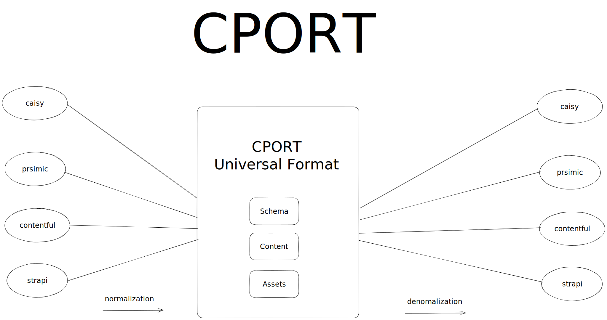

# Cport Project

The cport project aims to provide an import/export tool for multiple headless CMS platforms. The project roadmap outlines the main areas of development and progress status.

<div style="position: relative; padding-bottom: 51.9730510105871%; height: 0;"><iframe src="https://www.loom.com/embed/fc94726ced0442aaafe474c11edd95c9?sid=8ad2e97b-a17a-4b49-bf08-4a42c84a70f8" frameborder="0" webkitallowfullscreen mozallowfullscreen allowfullscreen style="position: absolute; top: 0; left: 0; width: 100%; height: 100%;"></iframe></div>



Very importat is this provider interface that every provider needs to implement: https://github.com/caisy-io/cport/blob/0dc3929afa285f80eef059366b0cfc7d20c44836/src/lib/common/types.ts


## Topics:

1. **Find a Good Normalization Format:** Find a compatible format for normalization that can handle all CMS data structures. This involves:
   - Content Types
   - Entries
2. **Write Exporter:** Develop modules that fetch data from each CMS API.
3. **Write Importer:** Develop modules that write data to each CMS API.
4. **Write Normalization Functions:** Develop normalization functions for each headless CMS, which involves:
   - Content Types
   - Entries
5. **Write Denormalization Functions:** Develop denormalization functions for each headless CMS, which involves:
   - Content Types
   - Entries

## Progress Status:

Below is a matrix-based table showing the progress for each headless CMS.

| Headless CMS | Normalization function | Denormalization function | Export | Import |
| ------------ | ---------------------- | ------------------------ | ------ | ------ |
| Caisy        | 🚧                     | 🚧                       | 🚧     | 🚧     |
| Contentful   | 🚧                     | ❌                       | 🚧     | ❌     |
| Strapi       | 📅                     | 📅                       | 📅     | 📅     |
| Prismic      | 🚧                     | ❌                       | 🚧     | ❌     |

## Key:

- ✅ - Completed
- 🚧 - In Progress
- 📅 - Planned, not started
- ❌ - Not yet planned but in consideration

# Headless CMS Naming Conventions

In different Headless CMS platforms, the terms used to refer to Content Models can vary. This document provides a comparison of these terminologies across several popular platforms.

| Headless CMS | Naming for Content Model                 |
| ------------ | ---------------------------------------- |
| Caisy        | Blueprints                               |
| Contentful   | ContentType                              |
| Strapi       | ContentType, CollectionType, Single Type |
| Prismic      | Types, Slices                            |

## Explanation:

**Caisy:** In Caisy, content models are referred to as 'Blueprints'. These blueprints are the structural design that content adheres to.

**Contentful:** Contentful uses the term 'ContentType' to define the structure that content should follow.

**Strapi:** Strapi uses several terms to refer to its content models: 'ContentType', 'CollectionType', and 'Single Type'. These terminologies provide flexibility in defining the structure and behavior of the content.

**Prismic:** In Prismic, 'Types' and 'Slices' are used. Both are treated as content types, offering different ways to structure and segment your content.

# USAGE

### INSTALL

```bash
yarn
```

### run in dev mode

```bash
yarn dev
```
